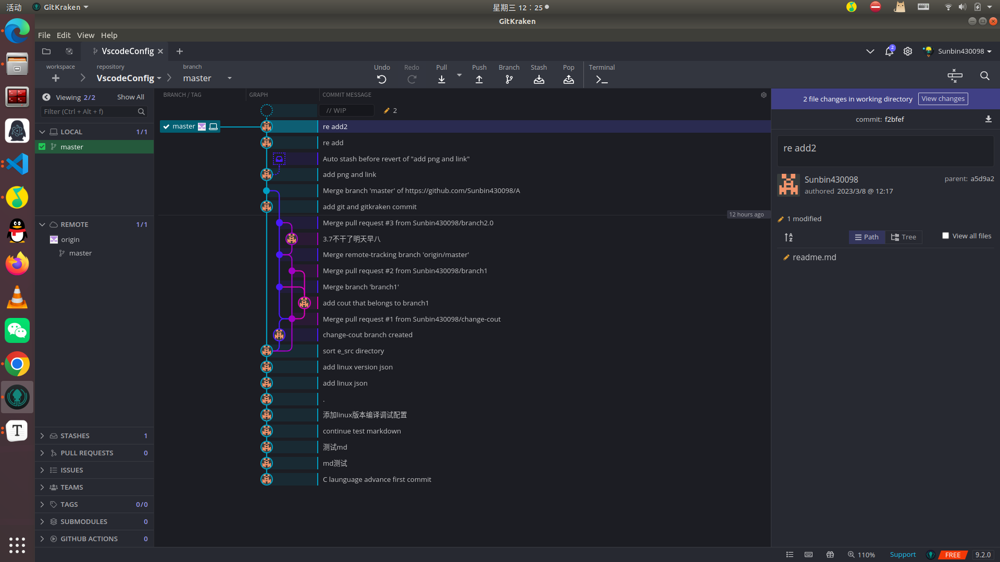

# C语言进阶


## vscode C工程配置

### g++编译调试流程：(单文件编程)

新建文件夹打开之后，直接将.vscode文件夹粘贴进去即可
完整流程：
    tasks.json是编译器，里面除了MinGW64路径之外其余都不用改
        终端->配置默认生成任务->g++
    launch.json是调试器，同样只需要改MinGW64路径
        运行->添加配置->g++
    注意：路径不要有中文
快捷按钮：右上角三角按钮(运行加调试)
(linux以及windows版本编译调试均有，多文件建议使用cmake)


### cmake编译调试流程：(多文件编程)

​    建立：
​        ctrl+shift+p->cmake q(cmake快速开始)->输入项目名称->excutable
​        ->界面最下方编译即可生成项目的build完整目录
​    基础模板：
​        cmake_minimum_required (VERSION 2.8.12)#规定cmake的最低版本要求
​        project(Cmake_test)#项目的名称，不一定和你的文件夹名称一样
​        set(CMAKE_CXX_COMPILER "g++")#设置c++编译器        	

	include_directories(${PROJECT_SOURCE_DIR}/include)#添加头文件的搜索路径
	add_executable(demo ${SrcFiles})#设置可执行文件的名称[${SrcFiles}替换为main函数文件+源文件] 
	快捷按钮：编译是最下栏build，运行是三角，调试是中间的乌龟    


## cmake使用

## １．cmake命令

### a)基本命令

#### cmake_minimum_required(VERSION xxx)	能使用该项目的最低cmake版本

### project(xxx)	设置项目名称(每个项目都需要此调用，并且应在 cmake_minimum_required() 之后立即调用)

### message(STATUS	"xxx")	运行Cmakelists.txt时向终端输出的信息

### b)项目构建的重要函数

### add_executable(head src/xxx  )	可执行文件(可以表示多个，方便更改)	

```cmake
set(SRC_LIST a.cpp b.cpp c.cpp)	  #可以用变量代替多个文件,${}用在引用时,文件后缀是啥无所谓
add_executable(${PROJECT_NAME} ${SRC_LIST})
```

### aux_source_directory	该命令会查找指定目录下的所有源文件，然后将结果存进指定变量名(对大工程更加方便，前提是确定他们公用一个名称)

```cmake
aux_source_directory(.DIR_SRCS)	#查找当前目录下所有源文件，将源文件名字保存到DIR_SRCS变量(.后面的大写变量名)
add_executable(demo ${DIS_SRCS})
```

### add_subdirectory()	指明本项目下包含一个子目录，目的是子目录下的Cmakelists.txt以及源代码也会被处理(经典例子:ROS　catkin_make后的主目录Cmakelists.txt和./src工程里面的Cmakelists.txt)

### target_link_libraries()	添加链接库

```cmake
target_link_libraries(joy_pub
  ${catkin_LIBRARIES}
  ${OpenCV_LIBS}
)#joy_pub是名称，对照之前的demo，第二个参数是要链接的库 
target_link_libraries(use_head
  head#自定义消息或多文件编程时,针对非executable文件，此处要添加自定义头文件的名字
  ${catkin_LIBRARIES}
)
```

### link_directories()	link_libraries()	这两个不常用或被其他组合代替

### include_directories()	为项目添加头文件目录

```cmake
include_directories(${PROJECT_SOURCE_DIR}/include)#cmake

include_directories(include
  ${catkin_INCLUDE_DIRS})#ROS自定义头文件
```

### add_dependencies(head	(else head))	在目标之间添加依赖项，在自定义多文件工程的时候比较重要．参考[详细的介绍](https://blog.csdn.net/BeanGuohui/article/details/120217097)

### add_library()	使用指定的源文件向项目(project)中添加库，通俗理解就是把自定义的.h .c添加为一个有名字(第一个参数)的库，可执行文件的target_link链接到之后即可调用库	

### [上述链接](https://blog.csdn.net/BeanGuohui/article/details/120217097)综合运用了前述几个函数

总体架构为如下，逻辑上hello和world都是非exe，只有main.c可执行

├── CMakeLists.txt// 下面用主CMAKE表示
├── hello
│   ├── CMakeLists.txt		// 下面用HELLOCMAKE表示
│   ├── hello.c
│   └── hello.h
├── main
│   ├── CMakeLists.txt		// 下面用MAINCMAKE表示
│   └── main.c
└── world
    ├── CMakeLists.txt		// 下面用WORLDCMAKE表示
    ├── world.c
    └── world.h

```cmake
##主Cmake
cmake_minimum_required(VERSION 3.5)

add_subdirectory(main)
add_subdirectory(hello)
add_subdirectory(world)

add_dependencies(CmakeDemo hello world)
	#加这个东西的作用:如果按照add_subdirectories的顺序，先编译main再编译hello world
	#但是如果main中有变量或函数在hello和world中定义，程序就会报错比如找不到变量
	#此时加上add_dependencies(),表示先编译head(此处是CmakeDemo)的依赖(即hello world)，再编译main
	#这种函数并不是为了随便选择位置定义变量准备的，应当注意编码规范

#MainCmake
cmake_minimum_required(VERSION 3.5.1)
project(CmakeDemo C)
set(CMAKE_LIBRARY_OUTPUT_DIRECTORY /home/lib)
set(CMAKE_C_STANDARD 99)

add_executable(CmakeDemo main.c)

link_directories(/home/lib)

target_link_libraries(
        CmakeDemo
        hello
        world
)　
#ello和world经过后面的add_library()操作之后变成了两个库，由于没有被添加到路径(即检测不到)，所以需要target_linik链接

#WorldCmake
cmake_minimum_required(VERSION 3.5.1)

set(CMAKE_C_STANDARD 99)

add_library(world STATIC world.c world.h)#STATIC说明设置为静态库，啥都没有的话默认静态库

#Hello
Cmakecmake_minimum_required(VERSION 3.5.1)

set(CMAKE_C_STANDARD 99)

add_library(hello STATIC world.c hello.h)


```

## 2.动态静态库

#### １）理论知识

静态库	STATIC	(.a 	.lib)

动态库	SHARED	(.so	.dll)

PDF文档里为非常详细的说明，理论上very到位,windows操作不用管

### ２)Cmakelists.txt文件配置项目的库

[参考文档](https://blog.csdn.net/weixin_45004203/article/details/125256367?spm=1001.2101.3001.6661.1&utm_medium=distribute.pc_relevant_t0.none-task-blog-2%7Edefault%7EBlogCommendFromBaidu%7ERate-1-125256367-blog-123531206.pc_relevant_vip_default&depth_1-utm_source=distribute.pc_relevant_t0.none-task-blog-2%7Edefault%7EBlogCommendFromBaidu%7ERate-1-125256367-blog-123531206.pc_relevant_vip_default&utm_relevant_index=1)

###  3 )gcc/g++编译文件原理

[参考文档](https://blog.csdn.net/weixin_45004203/article/details/129367238)


## 扩充知识之git使用

## 1.基本命令

[git与vscode配置](https://blog.csdn.net/m0_51185558/article/details/126181439)

#### git init 		初始化git仓库

#### git config --global user.name “your name”

#### git config --global user.email “email@email.com“

#### git config --global --list	配置账号信息

#### ssh-keygen -t rsa -C “email@email.com"	创建ssh密钥，方便与远程库直连


## 2.git 基本框架

### 	local	介绍

​		本地库 所有git对project的操作都是在本地完成，只有推拉等方面的操作涉及与远程库的联系

### 	remote	介绍

​		远程库	可以视作本地库的一个备份

```
#### git remote add origin git@github.com:xxx.git　#为本地库添加远程仓库连接

#### git remote -v　#查看远程库信息

#### git remote rm origin	#删除当下与远程库的连接

#### git clone git@github.com:xxx.git #克隆项目

#### git commit -a -m “some commit" #向本地库提交更改

#### git push -u origin master　#推到远程仓库
```


## 3.GirKraken 中涉及的可视化git

<div align="kraken gui">

</div>

使用可视化界面主要用于操作分之(branch)

LOCAL下面为本地库，添加branch的时候只能在LOCAL添加，添加之后会提示建立同名远程库(origin/xx)

添加之后双击图像进入分支，右侧选择view all files可以操作project，也可以查看path或tree项目架构

对project内容更改之后　在修改区记得stage all changes,添加Commit Message后点击commit即可

此时更改被添加至本地branch或master库(只在当前分支，其他分支看不到更改)

### branch并入操作

pull request 配置可以选择从本地当前库到master或远程库，origin需要在github.com同意验证

但是此操作主要是为开源项目项目做代码贡献

分支合并可以拖动分支条到目的分支或master,实际上是进行git merge


